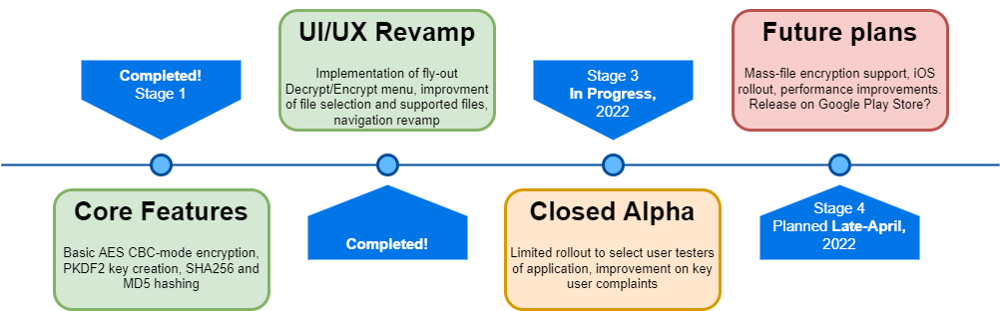

 
  

<h1 align="center"> fencrypt </h1>
<h3 align="center"> An AES file encryption app built with Xamarin in C# and designed to be compatible on all Android API releases.</h3> 

 

<!-- TABLE OF CONTENTS -->
<h2 id="table-of-contents"> :book: Table of Contents</h2>

  
Table of Contents

  <ol>
    <li><a href="#about-the-project"> ➤ About The Project</a></li>
    <li><a href="#prerequisites"> ➤ Prerequisites</a></li>
    <li><a href="#roadmap"> ➤ Roadmap</a></li>
    <!--<li><a href="#experiments">Experiments</a></li>-->
    <li><a href="#references"> ➤ References</a></li>
  </ol>

<!-- ABOUT THE PROJECT -->
<h2 id="about-the-project"> :pencil: About The Project</h2>

 
  This project aims to create a cross-API compatible Android application for the encryption and decryption of various file formats utilizing the Advanced Encryption Standard (AES)
  with 256-bit key length and 128-bit initialization vector. It currently utilizes a user-selected password which is put through a PKDF2 password-based key derivation function, a SHA-256 hash function, as well as an MD5 hash function to generate the initialization vector from the user password. AES Encryption occurs in CBC mode for now. While CBC is not used on the internet often due to lack of authentication, for local files which will not require random access, it is more than secure enough
  and greatly improves performance on lower-end hardware.
  As of Android API 29 (Android 10), there were numerous new changes brought about, including the requirement to use Scoped Storage file access -- this means that apps no longer
  have the same file access privaleges as they historically did. Unfortunately, many of the new methods used for creating and reading files break on lower API levels, so this
  necessitates the creation of separate read/write functions - one for API's 28 or below and one for API's 29 or above. There are also plans in the future to improve the UI
  interface and port support over to iOS.

  

<!-- PREREQUISITES -->
<h2 id="prerequisites"> :safety_vest: Prerequisites</h2>

 
  Currently, the project code has been tested on a number of Android devices(Huawei Mate 9, P30 Pro, OnePlus 8, 8T, Google Pixel 2), so an Android device running at least API Level 21 (Android Lollipop, 5.0.0+) is required. Older Android devices may or may not work! You should ideally target Android 11 (API Level 30).
  
  If you want to clone and refactor or improve the code on your own end, you must ensure that your dev environment has 
  <a href="https://dotnet.microsoft.com/en-us/apps/xamarin">Xamarin</a> support. If you don't want to build the .APK file yourself, you should use
  the <a href="https://docs.microsoft.com/en-us/xamarin/android/get-started/installation/android-emulator/device-manager?tabs=windows&pivots=windows">Android Device Manager</a> to emulate your desired device.

<!-- ROADMAP -->
<h2 id="roadmap"> :world_map: Roadmap</h2>

 
  The project has reached the stage where core functionalities have been finally implemented successfully, but there is still a focus on improving these functionalities
  based on user feedback from a limited rollout closed beta. Most big UI/UX tweaks have been made, with some more potentially possible in the future, as well as additional testing on various devices. Review of core functionalities by those knowlegeable in cryptography has begun, where based on their feedback, some functions could be improved.

  

